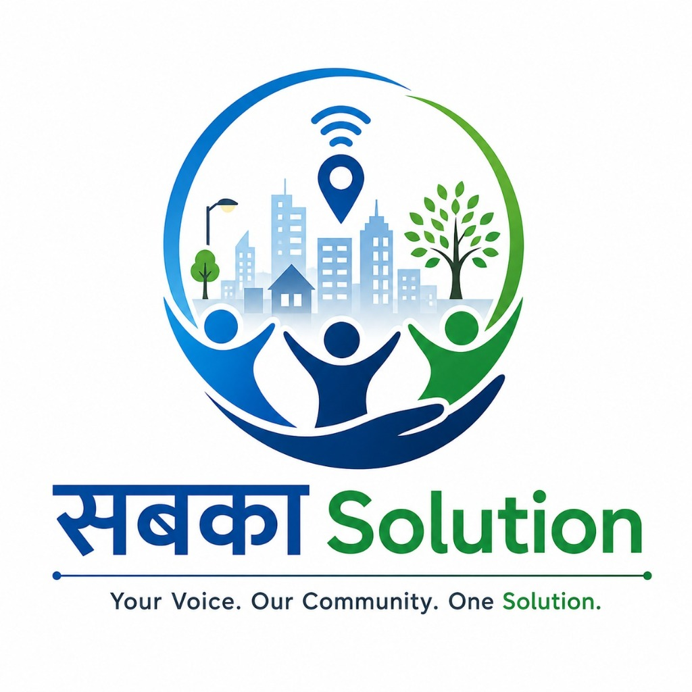

<div align="center">
  

  # Sabka Solution 🚀
  
  **Community action, real-time impact.** <br>
  A modern, citizen-first platform where people can seamlessly report, verify, and track civic issues in their community.

  [](https://nextjs.org/)
  [](https://firebase.google.com/)
  [](https://tailwindcss.com/)
  [](https://www.framer.com/motion/)

  [View Live Demo](https://sabka-solution.web.app) •
  [Report an Issue](#) •
  [Documentation](#)
</div>

<br />

## ✨ Features

- 🌍 **Comprehensive Multi-Language Support:** Automatically translates both the UI and user-generated dynamic content (reports, AI analysis) into 8 regional languages (Hindi, Kannada, Tamil, Telugu, Bengali, Malayalam, Marathi, English).
- ⚡ **Instant Reporting:** AI-powered categorization ensures your civic issue reaches the right authorities immediately.
- 🛡️ **Verified Impact & Gamification:** Build your Trust Score by verifying issues. The higher your score, the more influence your reports have!
- 🗺️ **Interactive Maps:** View real-time civic issues pinned to a map of your local area.
- 🎨 **Premium UI/UX:** A breathtaking interface built with Glassmorphism, Aurora backgrounds, and buttery-smooth micro-interactions.

---

## 🛠️ Technology Stack

- **Frontend:** [Next.js](https://nextjs.org/) (App Router), React 18, TypeScript
- **Styling:** [Tailwind CSS](https://tailwindcss.com/), [Shadcn UI](https://ui.shadcn.com/)
- **Animations:** [Framer Motion](https://www.framer.com/motion/), GSAP
- **Backend/BaaS:** [Firebase](https://firebase.google.com/) (Authentication, Firestore, Hosting)
- **Mapping:** Mapbox API

---

## 🚀 Getting Started

To get a local copy up and running, follow these simple steps.

### Prerequisites

Ensure you have Node.js (v18+) and npm installed on your machine.

### Installation

1. **Clone the repository:**
   ```bash
   git clone https://github.com/Gauri-gupta-18/sabka-solution.git
   ```

2. **Install dependencies:**
   ```bash
   cd sabka-solution
   npm install
   ```

3. **Set up Firebase Environment Variables:**
   Create a `.env.local` file in the root directory and add your Firebase and Mapbox configurations:
   ```env
   NEXT_PUBLIC_FIREBASE_API_KEY=your_api_key
   NEXT_PUBLIC_FIREBASE_AUTH_DOMAIN=your_auth_domain
   NEXT_PUBLIC_FIREBASE_PROJECT_ID=your_project_id
   NEXT_PUBLIC_FIREBASE_STORAGE_BUCKET=your_storage_bucket
   NEXT_PUBLIC_FIREBASE_MESSAGING_SENDER_ID=your_messaging_sender_id
   NEXT_PUBLIC_FIREBASE_APP_ID=your_app_id
   NEXT_PUBLIC_MAPBOX_TOKEN=your_mapbox_token
   ```

4. **Run the development server:**
   ```bash
   npm run dev
   ```

5. Open [http://localhost:3000](http://localhost:3000) with your browser to see the result.

---

## 📸 Screenshots

| Homepage | Dashboard |
| :---: | :---: |
| *(Beautiful Aurora and Glassmorphism Hero)* | *(Analytics, Reports, and Leaderboard)* |

---

## 🤝 Contributing

Contributions are what make the open source community such an amazing place to learn, inspire, and create. Any contributions you make are **greatly appreciated**.

1. Fork the Project
2. Create your Feature Branch (`git checkout -b feature/AmazingFeature`)
3. Commit your Changes (`git commit -m 'Add some AmazingFeature'`)
4. Push to the Branch (`git push origin feature/AmazingFeature`)
5. Open a Pull Request

---

## 🛡️ License

Distributed under the MIT License. See `LICENSE` for more information.

<div align="center">
  <sub>Built with ❤️ for a better civic future.</sub>
</div>
